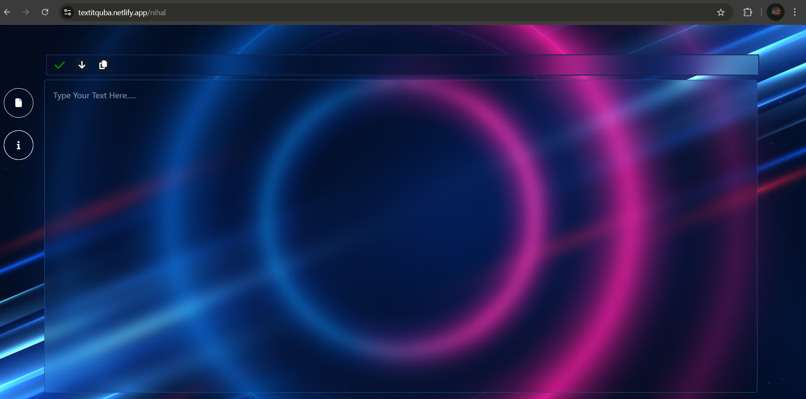
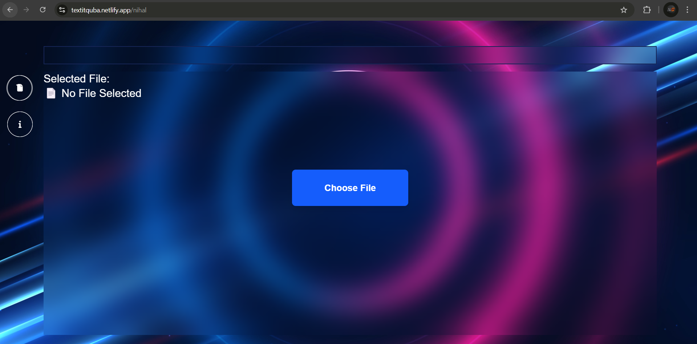
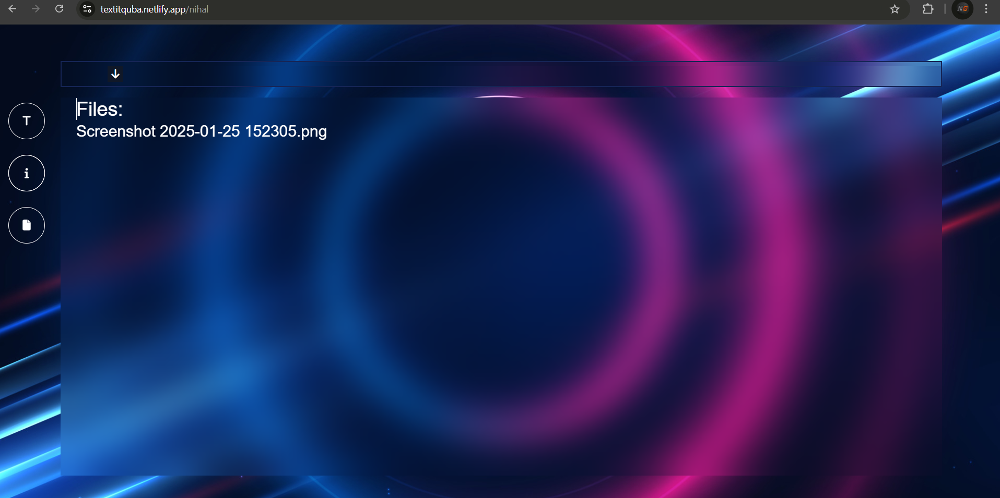

**Text-It**  
**Seamless Text & File Sharing Platform**  

---

### **Overview**  
Text-It is a streamlined platform designed for effortless text and file sharing. Instantly generate unique URLs for easy content distribution, with the option to assign custom filenames. All shared content is securely stored, ensuring seamless access and downloads. 

Text-It is ideal for developers, students, and professionals who need a quick way to share snippets, notes, and files. Whether you're collaborating on code, sharing lecture notes, or distributing project documentation, Text-It provides a simple and efficient solution. The platform ensures data security, reliability, and ease of access for all users. 

---
### **ScreenShot**
 
 ## Home Page Preview

 
 ## File Upload Page Preview



## FileList Page Preview

  


### **Key Features**  
- **Instant Sharing**: Upload text or files and receive a shareable URL within seconds.  
- **Custom Filenames**: Assign a specific filename (e.g., `/app/my-notes`) or let Text-It generate one automatically.  
- **Multi-Format Compatibility**: Supports **.txt files**, **images**, and other common formats.  
- **Easy Downloads**: Recipients can access and download shared content via the provided URL.  
- **Secure Storage**: All uploads are stored in a robust database for future retrieval.  
- **Download All in a Single Click**: Users can download all shared files in a single zip file.  
- **Export All Text Files**: Download all text files in a single `.txt` file for streamlined access.  

---

### **How It Works**  
1. **Upload Content**  
   - **Text**: Paste your text directly into Text-It.  
   - **File**: Upload files, including `.txt`, `.jpg`, `.png`, and more.  
2. **Generate a URL**  
   - Use an automatically generated filename (e.g., `/text/abc123`) or specify a custom name (e.g., `/text/my-project-notes`).  
3. **Share & Access**  
   - Distribute the generated URL (e.g., `https://textit.com/text/my-project-notes`).  
   - Recipients can view or download the content instantly.  
4. **Download Options**  
   - **Download All**: Users can download all uploaded files in a single `.zip` archive.  
   - **Download All Text**: Export all shared text content into a single `.txt` file.  

**Example Workflow**:  
```
https://textit.com/text/ → Generates a URL like /text/8f3gz  
https://textit.com/text/my-cat.jpg → Uses the custom filename "my-cat"  
```

---

### **Tech Stack**  
- **Database**: Supabase  
- **Frontend**: React, Tailwind CSS  
- **Hosting**: Netlify  

---

### **Getting Started**  
1. **Clone the Repository**:  
   ```bash  
   git clone https://github.com/Nihal1487/TextIt.git  
   ```  
2. **Install Dependencies**:  
   ```bash  
   npm install  
   ```    
3. **Run the Application**:  
   ```bash  
   npm run dev  
   ```  
4. Open `http://localhost:5173` to start sharing!  

---

### **Contributing**  
Contributions are welcome! Submit issues or pull requests to enhance Text-It.  

### **License**  
This project is licensed under [MIT License](LICENSE).  

---

